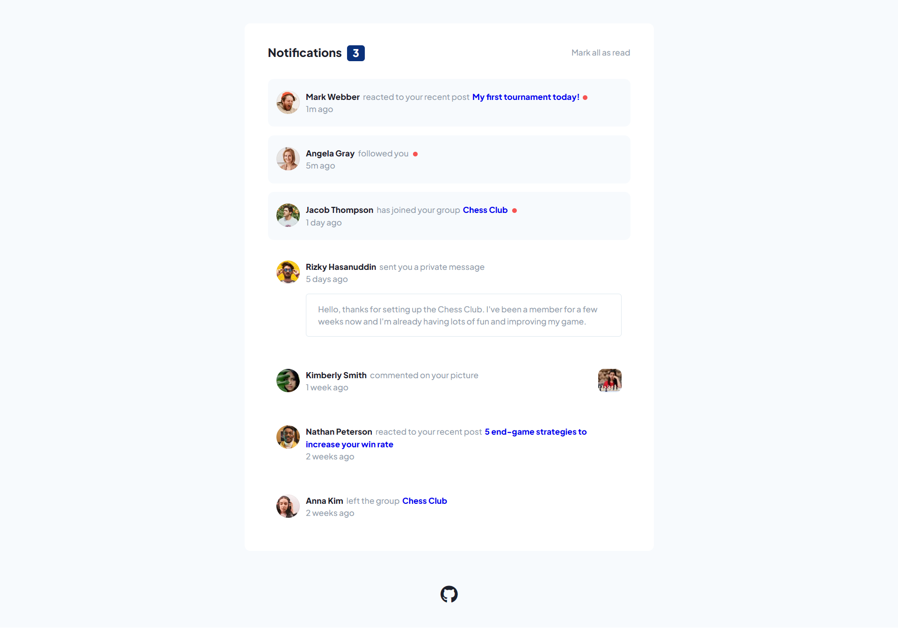

# Notifications Page


## Links
- [Challenge Link](https://www.frontendmentor.io/challenges/notifications-page-DqK5QAmKbC)
- [Site Preview](https://robinjmm-notifications-page.vercel.app/)

## About
This is my solution for the Notifications Page challenge from [Frontendmentor.io](https://www.frontendmentor.io/challenges/notifications-page-DqK5QAmKbC).

## User Stories
The user should be able to:
- Distinguish between "unread" and "read" notifications
- Select "Mark all as read" to toggle the visual state of the unread notifications and set the number of unread messages to zero
- View the optimal layout for the interface depending on their device's screen size
- See hover and focus states for all interactive elements on the page

## Built With
- HTML5
- CSS3
- Flexbox
- Sass
- PostCSS
- JavaScript
- Parcel

## Usage
You can download the project files by clicking on the green **Code** button,  then select **Download Zip**.

Once you finish extracting, open the terminal, move into the project folder, and run the following command while in the project directory:

```
npm install
```

This will install all the required dependencies.

To launch a development server while watching changes in your files, run the following command in your terminal.

```
npm run dev
```

To compile and optimize your code for production, run the following command in your terminal.

```
npm run build
```

## Acknowledgement
I'm very grateful to the people at [Frontendmentor.io](https://www.frontendmentor.io) for providing designs and challenges that help me improve my skills as a web developer.
